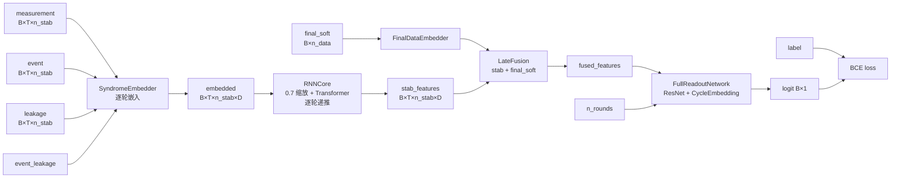
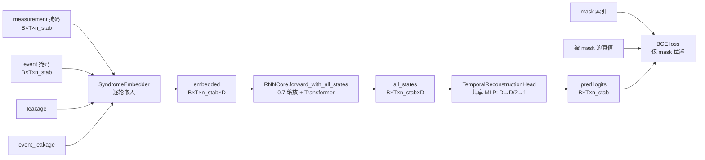
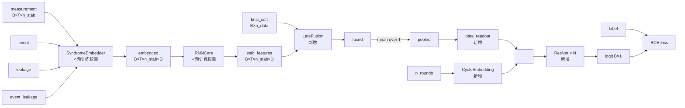

# AQ 与 BERT 解码器架构技术文档

> 版本：2026-07-21 ｜ 对象：AlphaQubit（AQ）解码器 与 BERT（自监督预训练+微调）解码器
> 代码来源：`alphaqubit/models/`（decoder.py, pretrain_decoder.py, rnn_core.py, transformer.py, fusion.py, readout.py, embeddings.py）+ `xzzx_decoder.py`
> 配图：`figures/fig_architecture_aq_bert.png`（matplotlib 科研图）+ 文内 Mermaid 流程图

---

## 0. 概述

本工程有两类解码器，**共享编码器核心**，区别在**预训练目标与头部**：

- **AQ（AlphaQubitDecoder）**：全监督。合成数据带 label 预训练 + 真机 label 微调，全程用 final_soft + LateFusion + FullReadoutNetwork
- **BERT（PretrainDecoder + FineTuneDecoder）**：自监督预训练（掩码预测，**不用 label、不用 final_soft**）+ 监督微调（加 final_soft + LateFusion + readout）

| | AQ | BERT 预训练 | BERT 微调 |
|---|---|---|---|
| 目标 | label 分类（监督）| syndrome 掩码预测（自监督）| label 分类（监督）|
| final_soft 输入 | ✓ | ✗ | ✓ |
| LateFusion | ✓ | ✗ | ✓ |
| 头部 | FullReadoutNetwork | TemporalReconstructionHead | data_readout + ResNet |
| 编码器核心 | 共享 | 共享 | 共享（加载预训练权重）|

---

## 1. 共享编码器核心

两者编码器相同，负责把 syndrome 序列编码为时空表示。

### 1.1 SyndromeEmbedder（综合征嵌入器）
- **输入**：measurement [B, n_stab]、event [B, n_stab]、leakage [B, n_stab]、event_leakage [B, n_stab]（单轮）+ position_idx（空间坐标散射索引）
- **输出**：embed [B, n_stab, D]（D=embed_dim，如 256）
- **作用**：把 4 路软信号 + 空间位置编码成高维嵌入。用 grid_positions=(d+1)² 的位置嵌入

### 1.2 RNNCore（时序递推核心）
- **输入**：embedded [B, T, n_stab, D] + stab_positions
- **输出**：stab_features [B, T, n_stab, D]（或 all_states）
- **机制**：
  - 逐轮递推：`state = (state + syndrome_embed[t]) * 0.7`（0.7 缩放保方差，防止信息爆炸/衰减）
  - 每轮内：**SyndromeTransformer**（双向自注意力 + spatial_bias）处理 stab 维
  - `forward_with_all_states` 返回每轮中间状态（BERT 预训练用）；`forward` 返回最终特征（微调用）

### 1.3 SyndromeTransformer（双向 Transformer）
- **结构**：num_transformer_layers 层（如 4 层）× n_heads（如 8）自注意力
- **注意力**：`attention = softmax(QK^T/√d + spatial_bias)`，spatial_bias = distance_embed(成对距离) + learned_bias
- **双向**：每个 stab 注意所有 stab（bidirectional，BERT 式，非 GPT 因果）
- **卷积**：每层 Transformer 内含 num_conv_layers 层卷积（局部特征提取）

---

## 2. AQ 架构（全监督）

### 2.1 组件清单
```
AlphaQubitDecoder
├── SyndromeEmbedder          # syndrome 嵌入
├── FinalDataEmbedder/SoftEmbed # final_soft 嵌入 [B, n_data] -> [B, n_data, D]
├── RNNCore                   # 时序 + Transformer
├── LateFusion                # 融合 stab_features + final_soft
├── FullReadoutNetwork        # 深层 ResNet 读出（含 CycleEmbedding）
└── output: logit [B, 1]
```

### 2.2 数据流（Mermaid）


### 2.3 关键点
- **final_soft 全程参与**：末轮 data qubit 软读出直接反映逻辑状态，对 label 预测极有价值
- **LateFusion**：把 stab 时序特征与 final_soft 融合（concat 投影）
- **FullReadoutNetwork**：深层 ResNet（4-6 层），含 CycleEmbedding（编码 n_rounds，支持不同轮数）
- **监督训练**：从合成预训练到真机微调，都用 label 做 BCE

---

## 3. BERT 预训练架构（自监督掩码）

### 3.1 组件清单
```
PretrainDecoder
├── SyndromeEmbedder          # 同 AQ（共享）
├── RNNCore                   # 同 AQ（共享，用 forward_with_all_states）
├── TemporalReconstructionHead # 掩码预测头（轻量 MLP）
└── output: pred [B, T, n_stab]
```

### 3.2 数据流（Mermaid）


### 3.3 关键点（与 AQ 的差异）
- **无 final_soft**（`pretrain_decoder.py:107` 注释："不使用 final_soft（预训练不需要最终 data qubit 测量）"）
- **无 LateFusion、无 FullReadoutNetwork**：预训练只需 syndrome 内部结构
- **TemporalReconstructionHead**：轻量 MLP（Linear(D→D/2) → GELU → Linear(D/2→1)），从每轮中间状态预测该轮 syndrome bit。**预训练后丢弃**
- **掩码策略**（`MixedStructuredMSM`）：40% 随机 + 30% 空间簇 + 30% 时序跨度，mask_ratio~0.25
- **自监督**：只需 syndrome，不需逻辑 label，可利用 125M 无标注合成数据

---

## 4. BERT 微调架构（监督，加载预训练 encoder）

### 4.1 组件清单
```
FineTuneDecoder (XZZXFineTuneDecoder)
├── SyndromeEmbedder          # 加载预训练权重
├── RNNCore                   # 加载预训练权重
├── LateFusion                # 新增（预训练没有）
├── data_readout              # 新增（LayerNorm+Linear+GELU）
├── CycleEmbedding            # 新增（编码 n_rounds）
├── ResNetBlock × N           # 新增（读出 ResNet）
└── output: logit [B, 1]
```

### 4.2 数据流（Mermaid）


### 4.3 关键点
- **encoder 加载预训练**：SyndromeEmbedder + RNNCore 从 PretrainDecoder 迁移（`_load_pretrained_encoder`）
- **新增 final_soft + LateFusion + readout**：预训练没见过的 final_soft 在微调首次引入
- **微调 = AQ 架构**：此时数据流与 AQ 几乎一致（encoder + LateFusion + readout），唯一区别是 encoder 初始化来源（BERT 从掩码预训练来，AQ 从监督预训练来）

---

## 5. 张量形状流转（d7 为例，D=256, T=10, n_stab=48, n_data=49）

### AQ / BERT 微调
| 步骤 | 张量 | 形状 |
|---|---|---|
| 输入 | measurement/event/leakage/event_leakage | [B, 10, 48] |
| 输入 | final_soft | [B, 49] |
| SyndromeEmbedder（逐轮）| embedded | [B, 10, 48, 256] |
| RNNCore | stab_features | [B, 10, 48, 256] |
| LateFusion | fused | [B, 10, 48, 256] |
| mean over T | pooled | [B, 48, 256] |
| data_readout | x | [B, 48, 64] |
| + CycleEmbedding | x | [B, 48, 64] |
| ResNet × N | x | [B, 48, 64] |
| output_layer | logit | [B, 1] |

### BERT 预训练
| 步骤 | 张量 | 形状 |
|---|---|---|
| 输入 | measurement/event（部分掩码）| [B, 10, 48] |
| SyndromeEmbedder | embedded | [B, 10, 48, 256] |
| RNNCore.forward_with_all_states | all_states | [B, 10, 48, 256] |
| TemporalReconstructionHead | pred | [B, 10, 48] |
| loss | BCE(pred[mask], target[mask]) | 标量 |

---

## 6. 架构差异总结

| 维度 | AQ | BERT 预训练 | BERT 微调 |
|---|---|---|---|
| **SyndromeEmbedder** | ✓ | ✓ 共享 | ✓ 加载预训练 |
| **RNNCore** | ✓ forward | ✓ forward_with_all_states | ✓ 加载预训练 |
| **final_soft 输入** | ✓ | ✗ | ✓ |
| **LateFusion** | ✓ | ✗ | ✓ 新增 |
| **头部** | FullReadoutNetwork | TemporalReconstructionHead | data_readout+ResNet |
| **训练目标** | label（监督）| 掩码预测（自监督）| label（监督）|
| **头部去留** | 保留 | 丢弃 | 保留 |

**核心洞察**：
1. **编码器核心完全共享**（SyndromeEmbedder + RNNCore + SyndromeTransformer）
2. **AQ 与 BERT 微调架构几乎相同**（都 encoder + LateFusion + readout），唯一区别是 encoder 初始化
3. **BERT 预训练是"精简版"**：去掉 final_soft/LateFusion/readout，只留 encoder + 轻量掩码头，专注于学 syndrome 内部结构
4. **若 BERT 预训练改用 label + 补齐 final_soft/LateFusion/readout = 完全等同 AQ**

---

## 7. 科研架构图

详见 `figures/fig_architecture_aq_bert.png`（matplotlib 绘制，三栏对比 AQ / BERT 预训练 / BERT 微调的数据流）。


---

## 附录：关键代码位置

| 组件 | 文件 | 行 |
|---|---|---|
| AlphaQubitDecoder | `alphaqubit/models/decoder.py` | L71 |
| PretrainDecoder | `alphaqubit/models/pretrain_decoder.py` | L103 |
| FineTuneDecoder | `alphaqubit/models/pretrain_decoder.py` | L293 |
| TemporalReconstructionHead | `alphaqubit/models/pretrain_decoder.py` | L29 |
| SyndromeEmbedder | `alphaqubit/models/embeddings.py` | - |
| RNNCore | `alphaqubit/models/rnn_core.py` | - |
| SyndromeTransformer | `alphaqubit/models/transformer.py` | - |
| LateFusion | `alphaqubit/models/fusion.py` | - |
| FullReadoutNetwork | `alphaqubit/models/readout.py` | - |
| XZZXAlphaQubitDecoder | `google_paems_data/bert_experiment/xzzx_decoder.py` | L38 |
| MixedStructuredMSM | `google_paems_data/bert_experiment/mixed_msm.py` | - |
